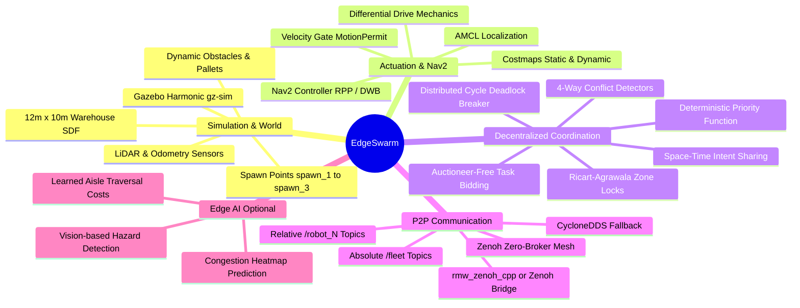

# EdgeSwarm: Decentralized Multi-AMR Fleet Coordination

> **Distributed, Peer-to-Peer Autonomous Mobile Robot (AMR) Fleet Coordination and Navigation for Smart Warehouses**  
> *Zero Central Server · ROS 2 Jazzy · Gazebo Harmonic · Zenoh / DDS P2P · Nav2 · Optional Edge-AI*

---

## 📌 Executive Architecture & System Flow

EdgeSwarm is designed without any central coordinator or single point of failure. Every AMR is an autonomous agent operating with its own local sensing, navigation stack, and peer-to-peer coordination engine.

```mermaid
flowchart TD
    subgraph Sim ["Gazebo Harmonic Simulation (Physics & Sensors)"]
        GZ_WORLD["Warehouse World (12m x 10m)\nShelves, Aisles, Dropoffs"]
        GZ_PHYS["DiffDrive Physics Engine"]
        GZ_SENS["2D LiDAR & Virtual Sensors"]
        GZ_WORLD --> GZ_PHYS
        GZ_WORLD --> GZ_SENS
    end

    subgraph Bridge ["ros_gz_bridge (Transport Bridge)"]
        BR_ODOM["/robot_N/odom (Gazebo -> ROS)"]
        BR_SCAN["/robot_N/scan (Gazebo -> ROS)"]
        BR_CLOCK["/clock (Gazebo -> ROS)"]
        BR_CMD["/robot_N/cmd_vel (ROS -> Gazebo)"]
    end

    GZ_PHYS --> BR_ODOM
    GZ_SENS --> BR_SCAN
    Sim --> BR_CLOCK
    BR_CMD --> GZ_PHYS

    subgraph Nav ["ROS 2 & Nav2 Autonomous Navigation Stack"]
        RSP["Robot State Publisher & TF\n(URDF/Xacro Transform Tree)"]
        LOC["Localization (AMCL / EKF)\nMap <-> Odom Transform"]
        COST["Global & Local Costmaps\nStatic Map + Dynamic Obstacles"]
        PLANNER["Nav2 Path Planner\n(Global Smac / NavFn)"]
        CONTROLLER["Nav2 Controller\n(RPP / DWB cmd_vel_raw)"]
        GATE["Motion Permit Safety Gate\n(GO / SLOW / STOP / YIELD)"]
        
        LOC --> COST
        COST --> PLANNER
        PLANNER --> CONTROLLER
        CONTROLLER --> GATE
        GATE --> BR_CMD
    end

    BR_ODOM --> LOC
    BR_ODOM --> RSP
    BR_SCAN --> LOC
    BR_SCAN --> COST

    subgraph Coord ["Decentralized Coordination (amr_fleet/core)"]
        COORDINATOR["Coordinator Decision Engine (10 Hz Tick)"]
        SPATIAL["Space-Time A* Planner & Intent Claim"]
        RA_ZONES["Ricart-Agrawala Priority Zones (Mutual Exclusion)"]
        CONFLICT["4-Way Conflict Detector (CELL, SWAP, ZONE, TTC)"]
        DEADLOCK["Distributed Wait-For Graph (Cycle Detection)"]
        AUCTION["Auctioneer-Free Task Auction (Distributed Bidding)"]

        COORDINATOR --> SPATIAL
        COORDINATOR --> RA_ZONES
        COORDINATOR --> CONFLICT
        COORDINATOR --> DEADLOCK
        COORDINATOR --> AUCTION
    end

    BR_ODOM --> COORDINATOR
    BR_SCAN --> COORDINATOR
    COORDINATOR --> GATE

    subgraph Comms ["Zenoh / DDS Decentralized Peer-to-Peer Mesh"]
        ZENOH_ROUTER["Zenoh P2P Protocol (rmw_zenoh_cpp / Bridge)\nUltra-low latency, Multicast-free Discovery"]
        T_STATE["/fleet/robot_state (10 Hz Best Effort)"]
        T_INTENT["/fleet/intent (Space-Time Claims)"]
        T_ZONES["/fleet/zone_request & /fleet/zone_grant"]
        T_TASKS["/fleet/task_announce, bid & award"]
        
        ZENOH_ROUTER --- T_STATE
        ZENOH_ROUTER --- T_INTENT
        ZENOH_ROUTER --- T_ZONES
        ZENOH_ROUTER --- T_TASKS
    end

    COORDINATOR <==> Comms

    subgraph EdgeAI ["Edge AI Module (Optional / Advanced Extension)"]
        AI_CONGEST["Predictive Bottleneck & Congestion Forecaster"]
        AI_BIDS["Learned Cost & Battery Traversal Weighting"]
        AI_VISION["Onboard Anomaly & Obstacle Classification"]
        
        EdgeAI -.-> COORDINATOR
        EdgeAI -.-> PLANNER
    end

    style Sim fill:#1e293b,stroke:#3b82f6,stroke-width:2px,color:#fff
    style Bridge fill:#334155,stroke:#94a3b8,stroke-width:1px,color:#fff
    style Nav fill:#0f172a,stroke:#10b981,stroke-width:2px,color:#fff
    style Coord fill:#1e1b4b,stroke:#8b5cf6,stroke-width:2px,color:#fff
    style Comms fill:#312e81,stroke:#6366f1,stroke-width:2px,color:#fff
    style EdgeAI fill:#451a03,stroke:#f59e0b,stroke-width:2px,stroke-dasharray: 5 5,color:#fff
```

---

## 🧠 Architectural Mind Map



---

## 🛠️ Stack Breakdown & Roles

### 1. Gazebo Harmonic (Simulation & Sensors)
- **Role:** Generates ground-truth physics, wheel contact forces, collisions, and sensor data.
- **Environment:** `worlds/warehouse.sdf` containing a 12m × 10m layout, narrow aisles (0.9m), standard aisles (1.5m), rack rows, and pickup/drop-off zones.
- **Sensors:** 2D LiDAR (360 samples, 10 Hz, 8m range) and Differential Drive odometry.
- **Bridge:** `ros_gz_bridge parameter_bridge` maps Gazebo transport topics to standard ROS 2 message types (`/clock`, `/odom`, `/scan`, `/cmd_vel`).

### 2. ROS 2 Jazzy (AMR Core Operation)
- **Role:** Node lifecycle, TF transforms, executor scheduling, and inter-package messaging.
- **Topic Scoping Rule:**
  - **Per-Robot Topics (Relative):** `odom`, `scan`, `motion_permit`, `cmd_vel` → resolve to `/robot_N/<topic>`.
  - **Fleet-Wide Topics (Absolute):** `/fleet/robot_state`, `/fleet/intent`, `/fleet/zone_*`, `/fleet/task_*` → globally shared across all robots without namespaces.

### 3. Zenoh / DDS (Decentralized Communication)
- **Role:** High-throughput, low-latency peer-to-peer data distribution without a central master.
- **Why Zenoh:** Standard DDS multicast discovery saturates Wi-Fi networks in multi-robot environments. Zenoh provides point-to-point and routed communication with 99% reduced discovery traffic, ideal for distributed robotic swarms.
- **Operation Modes:**
  - `rmw_zenoh_cpp` for native ROS 2 RMW replacement.
  - Or `zenoh-bridge-ros2dds` running alongside local CycloneDDS instances.

### 4. Nav2 (Autonomous Navigation)
- **Role:** Path generation and path execution within the warehouse.
- **Interaction with Fleet Coordination:**
  - Coordination is **advisory and supervisory**. The fleet coordinator does not directly drive the wheels; it emits a `MotionPermit` (`GO`, `SLOW`, `STOP`, `YIELD`, `REROUTE`).
  - Nav2's output velocity `cmd_vel_raw` passes through the `motion_permit` gate before reaching Gazebo or hardware motors.

### 5. Edge AI (Optional / Future Phase)
- **Role:** Onboard machine learning models for proactive optimization:
  - **Congestion Heatmap Forecasting:** Predicts traffic bottlenecks before robots enter narrow aisles.
  - **Dynamic Task Valuation:** Neural network weighting for auction bids based on battery consumption and expected corridor congestion.
  - **Obstacle & Worker Detection:** Edge vision on robot cameras to classify unexpected obstacles (e.g. fallen pallet vs human worker).

---

## 📂 Repository Structure

```
edgeswarm_2/
├── .gitignore
├── README.md                      # Root project overview and architecture
└── ros2_ws/                       # ROS 2 Jazzy Workspace
    └── src/
        ├── amr_description/       # Coordination engine, robot model & fleet nodes
        │   ├── amr_fleet/         # Python package
        │   │   ├── core/          # PURE PYTHON: algorithms (zero rclpy dependencies)
        │   │   │   ├── astar.py       # Space-time A* path planner
        │   │   │   ├── conflict.py    # 4 conflict detectors (CELL, SWAP, ZONE, TTC)
        │   │   │   ├── coordinator.py # Master coordination decision engine
        │   │   │   ├── deadlock.py    # Distributed wait-for graph cycle detection
        │   │   │   ├── geometry.py    # Continuous closest point of approach / TTC
        │   │   │   ├── gridmap.py     # 2D occupancy grid & zone representation
        │   │   │   ├── models.py      # Dataclasses
        │   │   │   ├── peers.py       # Liveness & peer state tracking
        │   │   │   ├── priority.py    # Deterministic total-order priority function
        │   │   │   ├── tasks.py       # Auctioneer-free task auction logic
        │   │   │   └── zone.py        # Ricart-Agrawala mutual exclusion protocol
        │   │   └── nodes/         # ROS 2 Nodes
        │   │       ├── fleet_agent_node.py    # Main coordinator node per robot
        │   │       ├── fleet_monitor_node.py  # Live CLI fleet dashboard
        │   │       ├── mock_robot_node.py     # Standalone mock robot (no Gazebo)
        │   │       ├── qos_profiles.py        # Custom tuned QoS profiles
        │   │       └── task_generator_node.py # Task generation & announcement
        │   ├── config/            # CycloneDDS XMLs, fleet_params.yaml, warehouse_grid.yaml
        │   ├── docs/              # 9 comprehensive architectural design docs
        │   ├── launch/            # Launch files (mock, gazebo, single agent)
        │   ├── models/amr_robot/  # Gazebo SDF robot model
        │   ├── msg/               # 11 custom ROS 2 messages
        │   ├── srv/               # Custom ROS 2 services (Replan.srv)
        │   └── test/              # 62 unit tests (no ROS 2 installation required)
        ├── amr_navigation/        # Nav2 integration & actuator gating (TO BE BUILT)
        │   ├── CMakeLists.txt
        │   └── package.xml
        └── warehouse_sim/         # Gazebo simulation world & ros_gz_bridge
            ├── config/bridge.yaml # Gazebo <-> ROS 2 topic bridge rules
            ├── launch/            # single_amr.launch.py, three_amr.launch.py
            └── worlds/            # warehouse.sdf (12m x 10m warehouse)
```

---

## 📡 Message & Coordination Protocol

| Topic | Type | Scope | Direction / Role |
|---|---|---|---|
| `/clock` | `rosgraph_msgs/msg/Clock` | Global | Gazebo → ROS 2 simulation time |
| `/robot_N/odom` | `nav_msgs/msg/Odometry` | Per-Robot | Wheel odometry (Gazebo → ROS) |
| `/robot_N/scan` | `sensor_msgs/msg/LaserScan` | Per-Robot | 2D LiDAR readings (Gazebo → ROS) |
| `/robot_N/cmd_vel` | `geometry_msgs/msg/Twist` | Per-Robot | Motor drive command (ROS → Gazebo) |
| `/robot_N/motion_permit` | `amr_description/MotionPermit` | Per-Robot | Safety decision from coordinator to Nav2 |
| `/robot_N/coordination_path` | `nav_msgs/msg/Path` | Per-Robot | Planned path with time claims |
| `/fleet/robot_state` | `amr_description/RobotState` | Fleet-Wide | 10 Hz heartbeat & kinematic status |
| `/fleet/intent` | `amr_description/Intent` | Fleet-Wide | Spatio-temporal cell reservations |
| `/fleet/zone_request` | `amr_description/ZoneRequest` | Fleet-Wide | Mutex request for narrow aisles / intersections |
| `/fleet/zone_grant` | `amr_description/ZoneGrant` | Fleet-Wide | Mutex grant response |
| `/fleet/task_announce` | `amr_description/Task` | Fleet-Wide | New order / task published to fleet |
| `/fleet/task_bid` | `amr_description/TaskBid` | Fleet-Wide | Peer bid based on distance & battery |
| `/fleet/task_award` | `amr_description/TaskAward` | Fleet-Wide | Deterministic winner confirmation |

---

## 🚀 Quickstart Guide

### 1. Build the Workspace
```bash
cd ros2_ws
colcon build --symlink-install
source install/setup.bash
```

### 2. Mode A: Mock Fleet (No Gazebo Needed)
Test peer discovery, Ricart-Agrawala zone arbitration, and task auctioning in 2 seconds:
```bash
ros2 launch amr_description three_robots_mock.launch.py
```

### 3. Mode B: Full Gazebo Simulation
```bash
# Terminal 1: Launch 3-AMR Gazebo simulation and bridge
ros2 launch warehouse_sim three_amr.launch.py

# Terminal 2: Launch the 3 decentralized fleet agents & monitor
ros2 launch amr_description three_robots_gazebo.launch.py
```

---

## 📊 Project Status: Built vs. Left to Build

```
[████████████████████░░░░░░░░░░] 65% Completed
```

### ✅ What is Completed & Validated
- [x] **Pure-Python Core Algorithms (`amr_fleet/core`)**:
  - Deterministic priority function with anti-starvation ceilings.
  - 4-way conflict detection (overlapping cell time-windows, head-on swap, zone contention, continuous TTC).
  - Ricart-Agrawala distributed mutual exclusion for narrow aisles.
  - Cycle detection on distributed wait-for graphs for deadlock breaking.
  - Auctioneer-free task bidding and assignment.
  - Space-time A* path planning on occupancy grids.
- [x] **ROS 2 Fleet Integration (`amr_fleet/nodes`)**:
  - `fleet_agent_node`, `fleet_monitor_node`, `task_generator_node`, `mock_robot_node`.
  - 11 custom message definitions and 1 service.
  - 62 unit tests passing without requiring ROS runtime.
- [x] **Warehouse Simulation (`warehouse_sim`)**:
  - 12m × 10m warehouse SDF world with racks, aisles, dropoffs.
  - Multi-AMR Gazebo launch file (`three_amr.launch.py`).
  - Multi-AMR `ros_gz_bridge` configuration (`bridge.yaml`).

### 🔨 What is Left to Build
1. **AMR Robot Description (URDF / Xacro)**:
   - Create `amr.urdf.xacro` with parameterized namespacing (`prefix="robot_N/"`).
   - Add `robot_state_publisher` and `joint_state_publisher` to publish proper TF trees (`base_footprint -> base_link -> wheels, laser_link, imu_link`).
   - Create `display.launch.py` and RViz configuration (`amr.rviz`).
   - Add virtual IMU sensor definition and bridge topic `/robot_N/imu/data`.
2. **Autonomous Navigation (`amr_navigation`)**:
   - Currently an empty package skeleton.
   - Configure Nav2 stack (`planner_server`, `controller_server`, `bt_navigator`, `costmap_2d`).
   - Implement AMCL localization against warehouse map.
   - Build velocity interceptor node: gate Nav2 `cmd_vel_raw` using `motion_permit` before sending to `/cmd_vel`.
3. **Zenoh Communication Integration**:
   - Test and configure `rmw_zenoh_cpp` / `zenoh-bridge-ros2dds` for peer-to-peer Wi-Fi deployment.
4. **Edge AI Enhancements (Optional)**:
   - Add congestion heatmap forecaster to adapt Space-Time A* heuristic costs.
   - Add learned task valuation for auction bids.
