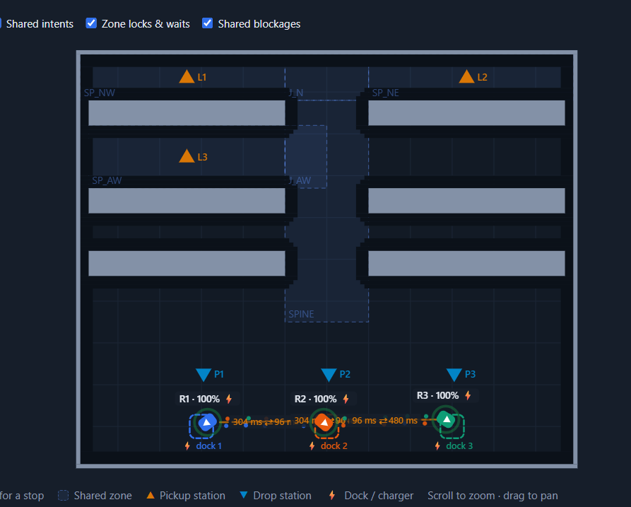
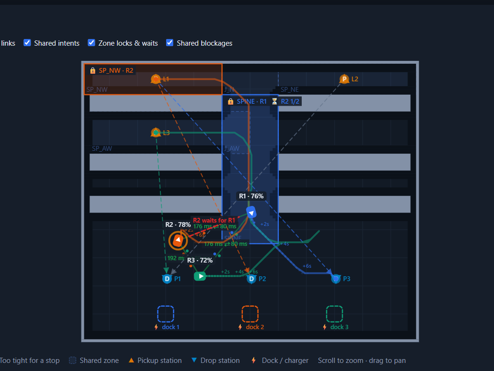

# EdgeSwarm

A decentralized fleet of three autonomous mobile robots for warehouse pick and
delivery, built on ROS 2 Jazzy, Nav2 and Webots. Robots coordinate peer to
peer with no central server: tasks are allocated by a distributed auction,
traffic flows on keep-right lanes with box junctions and right-of-way rules,
and collisions are prevented by a hitbox safety envelope computed from each
robot's real footprint and localization uncertainty.

## Fleet UI





The web UI runs on http://localhost:8080. It shows the live map, lanes,
junctions and landmarks, robot hitboxes with heading, task states and
manoeuvre badges (U-TURN, REVERSING, OVERTAKING). Tasks can be created by
clicking a rack slot and aborted before pickup.

## Features

- Auctioneer-free task allocation: every robot hears every bid and computes
  the same winner. Survives message loss, claim collisions, false peer
  deaths and mid-auction cancels.
- Street-model traffic: one-way lane per direction in every 1.6 m aisle,
  junction boxes with deterministic right-of-way (task priority, then
  near-station, then battery, then aging), no path or zone locking.
- U-turns and overtaking of stalled robots, gated on oncoming clearance and
  a swept-footprint fit check.
- Safety envelope: oriented wheel-inclusive hitbox (0.40 x 0.41 m) inflated
  by broadcast localization sigma and message age. Zero robot-robot
  contacts across all recorded runs.
- Rack slot addressing: 240 pick faces named 1R1 to 12R20, clickable in the
  UI and addressable in task messages.
- Deadline aging: old tasks gain priority in auctions and right of way.
- Localization support structure: ten asymmetric landmarks break the
  warehouse's lidar self-similarity; AMCL is tuned for 1 m/s driving with
  evidence-gated re-seeding and parked re-localization.
- Exact spawn-pose docking (measured 1 to 2 cm, about 1 degree).
- Offline fleet simulator running the real coordinator code at roughly 40x
  realtime, with lane-discipline and contact audits. 420+ pytest tests.

## Requirements

- Windows 11 with WSL2 running Ubuntu 24.04
- ROS 2 Jazzy inside WSL
- Webots R2025a installed on Windows at C:\Program Files\Webots
- Optional: Gazebo Harmonic (installed by setup.sh) for the Gazebo backend

## Setup

One-time, inside WSL Ubuntu:

```bash
git clone https://github.com/sarthakyerpude/edgeswarm_2.git
cd edgeswarm_2
./setup.sh
```

setup.sh checks ROS 2 Jazzy, installs the apt dependencies (Nav2, ros-gz,
CycloneDDS, the Webots ROS 2 driver, colcon, pytest), builds the workspace
with colcon, and prints the Windows-side steps:

1. Install Webots R2025a on Windows.
2. Allow the Webots controller port once, in an admin PowerShell:
   `netsh advfirewall firewall add rule name="Webots extern" dir=in action=allow protocol=TCP localport=1234`
3. Recommended `.wslconfig` (then `wsl --shutdown`): memory=8GB, swap=8GB,
   networkingMode=NAT, dnsTunneling=false.

## Running

From the repository root inside WSL:

```bash
./run.sh                  # Webots backend, RViz, web UI on :8080
./run.sh gazebo           # Gazebo backend
./run.sh webots rviz:=false          # headless viewing via the web UI only
./run.sh webots webots_gui:=true    # show the Webots window
```

Where to look once it is up (startup takes about 1 to 2 minutes):

- Web UI: http://localhost:8080 (map, tasks, badges, abort button)
- RViz window: hitboxes with front markers, lanes, rack labels, lidar
- Logs: printed to the launch terminal

Manual equivalent of run.sh:

```bash
source /opt/ros/jazzy/setup.bash
source install/setup.bash
ros2 launch amr_navigation_runtime three_amr.launch.py sim:=webots
```

Useful launch arguments: `sim:=webots|gazebo|external`, `rviz:=true|false`,
`webapp:=true|false`, `webots_gui:=true|false`, `task_interval_s:=12.0`.

## Tests and evaluation

```bash
cd src/amr_description && python3 -m pytest test/     # pure python suite
python3 tools/fleet_eval.py 480    # 8 min live scorecard (run while the sim is up)
python3 tools/lidar_probe.py       # lidar honesty check against ground truth
```

The offline simulator (`src/amr_description/test/fleet_sim.py`) runs the
real coordination code without ROS and is the fastest way to reproduce
traffic scenarios; see `test/fleet_scenarios.py` for ready-made ones.

## Project structure

```
src/amr_description         fleet core (auction, traffic, safety, planner),
                            ROS messages, grid/map config, web UI, tests
src/amr_navigation_runtime  Nav2 parameters, launch files, velocity gate,
                            goal bridge, AMCL map
src/webots_warehouse_sim    Webots world (racks, landmarks, robots) and drivers
src/warehouse_sim           Gazebo world and bridges
tools/                      fleet_eval.py scorecard, lidar_probe.py
SETUP.md                    detailed setup and troubleshooting guide
```

## Key configuration files

- `src/amr_description/config/warehouse_grid.yaml`: occupancy grid, rack
  slots, lanes, junctions, turnarounds, landmarks. Regenerate with
  `src/amr_description/scripts/warehouse_map_tool.py` after world changes.
- `src/amr_navigation_runtime/config/nav2_params.yaml`: Nav2 controller,
  AMCL and collision monitor settings. Each tuned value carries a comment
  explaining why.
- `src/amr_description/config/fleet_params.yaml`: fleet speeds, docking
  tolerances, peer timeouts.

## Troubleshooting

- Web UI stops loading after a sim restart: a Windows port relay can hold
  the old connection. Close the browser tab and reopen http://localhost:8080.
- Robots do not spawn / controller timeout: check the firewall rule for
  TCP 1234 and that Webots is installed at C:\Program Files\Webots.
- Everything is slow or robots freeze: check WSL memory (8 GB plus 8 GB
  swap recommended) and close RViz if you only need the web UI. The fleet
  tolerates load, but Webots real time factor drops.
- Webots exits by itself after 10 to 16 minutes on some machines: restart
  with ./run.sh; state is not persisted between runs by design.
- A run from a fresh clone needs ./setup.sh once; a plain rebuild is
  `colcon build --symlink-install` from the repo root.

## Known limitations

- Localization accuracy plateaus around 0.14 m mean and 0.4 m worst-case
  under load. Robots recover automatically from localization losses, but
  brief rack-face grazes can still occur at the error peaks. The next
  planned step is scan-to-map ICP correction on top of AMCL.
- The fallback (degraded localization) traffic mode restarts a waiting
  robot about 5 s after a junction clears, above the 1.5 s design target.
- Webots process lifetime on Windows hosts is limited (see Troubleshooting).
